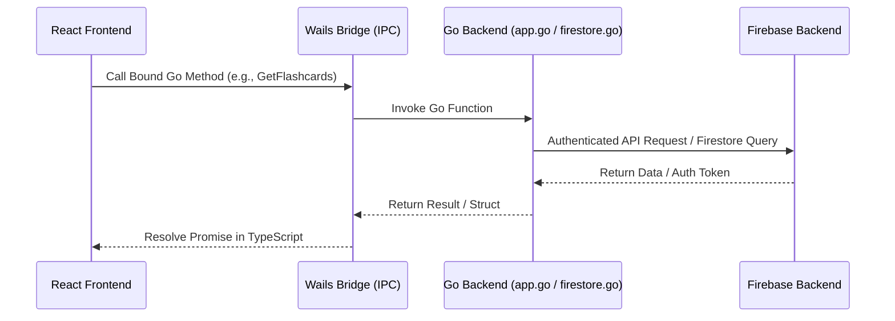

# Architecture Overview

The TaalGem Desktop Companion is structured as a cross-platform desktop application using [Wails v2](https://wails.io). It bridges a robust Go backend with a modern React and TypeScript frontend.

## Backend Modules

The Go backend (`/` directory) is split into focused functional concerns:
- **`app.go`**: Core Wails application struct (`App`), lifecycle hooks (`startup`, `domReady`, `shutdown`), and primary frontend-exposed methods.
- **`auth.go`**: Manages Google/Firebase authentication state, token refresh, and secure image proxying with SSRF protection (`isAllowedPhotoURL`).
- **`config.go`**: Handles local configuration persistence and app settings.
- **`firestore.go`**: Implements direct interaction with Firestore and backend APIs for user dictionaries, flashcards, and word decks.
- **`startup_*.go`**: Platform-specific startup routines (macOS, Windows, unsupported).

## Frontend Structure

The React application under `/frontend/src` is organized into:
- **State & Providers (`provider.tsx`, `App.tsx`)**: Global authentication and user state management.
- **Pages (`LoginPage.tsx`, `WordPage.tsx`, `settingsPage.tsx`)**: Core views for authentication, vocabulary management, and settings.
- **Components (`/components`)**: Modular UI elements including [Flashcards and Word Decks](/openwiki/domain/flashcards-and-decks.md) (`AnswerControls.tsx`, `WordDeckAssignments.tsx`), audio playback (`PlayAudioUrl.tsx`), and card state handling.

This architecture depends heavily on [Authentication and Sync](/openwiki/operations/authentication-and-sync.md) for secure cloud connectivity.
