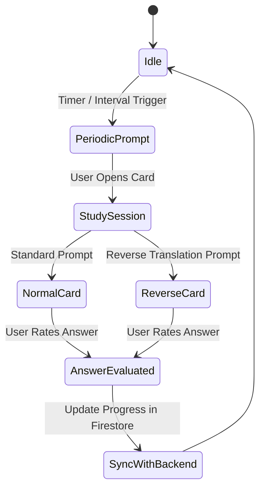

# Flashcards and Word Decks

Flashcard study and vocabulary tracking are at the core of the TaalGem learning experience. The application synchronizes user dictionary data from the backend to deliver interactive study sessions and periodic review prompts.

## Key Components

- **Study Cards (`NormalCard.tsx`, `ReverseCard.tsx`, `NormalImageCard.tsx`)**:
  - Present vocabulary words with audio pronunciation (`PlayAudioUrl.tsx`), context sentences, and optional images.
  - Support normal practice (foreign word to native) and reverse practice.
- **Answer Controls (`AnswerControls.tsx`, `answer-controls-logic.ts`)**:
  - Provide rating buttons (e.g., Hard, Good, Easy) to determine spaced repetition intervals and card progression.
- **Word Deck Assignments (`WordDeckAssignments.tsx`)**:
  - Allow users to organize vocabulary words into thematic or custom decks.
- **Completion States (`AllCardsDone.tsx`, `AllCatchUp.tsx`)**:
  - Handle celebratory completion screens when all daily reviews or catch-up items are finished.

These study components rely on secure data synchronization maintained by [Authentication and Sync](/openwiki/operations/authentication-and-sync.md) and interact with backend APIs defined in [Architecture Overview](/openwiki/architecture/overview.md).
