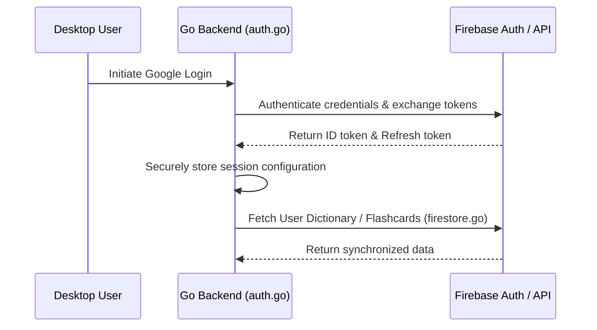

# Authentication and Sync

The TaalGem Desktop Companion relies on secure cloud authentication and backend synchronization to provide seamless user sessions across web and desktop.

## Security & Core Operations

- **Firebase Authentication (`auth.go`)**:
  - Implements Google login flow mirroring the web application (`gemini-dutch-practice`).
  - Manages secure token storage and automatic refresh.
- **SSRF Prevention & Image Caching (`auth.go`)**:
  - Functions such as `isAllowedPhotoURL` validate external profile photo URLs to protect against Server-Side Request Forgery (SSRF) vulnerabilities before downloading or caching assets.
- **Firestore & Backend APIs (`firestore.go`)**:
  - Interacts with backend endpoints for syncing user flashcards, dictionaries, and study progress.
  - **Firebase Document Concept**: Throughout this application and its backend integration, terms like "doc" or "document" refer specifically to internal **Firebase / Firestore cloud documents** (such as user dictionary state documents storing words, decks, and SRS metadata) rather than general file-system documents. Agents should interpret references to "doc" or "document" in this domain context and consult OpenWiki context when handling storage, retrieval, or synchronization questions.

Authentication ties directly into the [Flashcards and Word Decks](/openwiki/domain/flashcards-and-decks.md) system and is orchestrated by the [Architecture Overview](/openwiki/architecture/overview.md).
