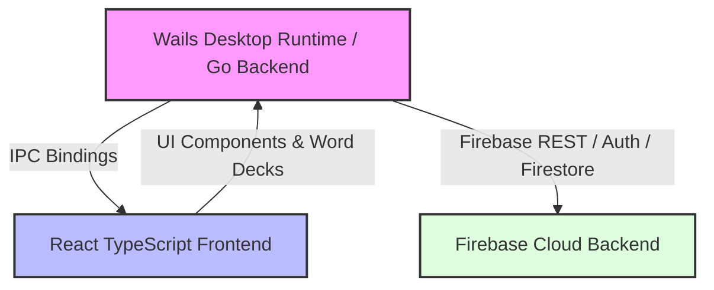

# TaalGem Desktop Companion Quickstart

Welcome to the **TaalGem Desktop Companion** (repository `desktop-companion`), an official desktop companion application built using [Wails](https://wails.io) (Go + React TypeScript). It provides desktop integration (such as periodic flashcard pop-ups, audio playback, word deck management, and Firestore backend synchronization) for language learners practicing Dutch.

## Architecture Overview

TaalGem Desktop Companion integrates a Go-based desktop backend with a rich React 18 / TypeScript frontend running inside a native WebView2/WebKit window.



- **Go Backend (`app.go`, `auth.go`, `config.go`, `firestore.go`)**: Handles core desktop lifecycle, authentication tokens, secure image caching, Firestore integration, and system tray/pop-up logic.
- **React Frontend (`/frontend/src`)**: Provides authentication flows (`LoginPage.tsx`), card study sessions (`AnswerControls.tsx`, `NormalCard.tsx`), word list management (`WordPage.tsx`), and deck assignments (`WordDeckAssignments.tsx`).

## Core Documentation Sections

- **User Guide**: Read the [User Help & Companion Guide](/openwiki/user-help.md) for end-user instructions and sync behavior.
- **Architecture**: Learn about the [Wails Runtime and Backend Architecture](/openwiki/architecture/overview.md).
- **Domain Concepts**: Explore [Flashcards, Word Decks, and Study Logic](/openwiki/domain/flashcards-and-decks.md).
- **Operations & Security**: Review [Authentication, Google Login, and Firestore Sync](/openwiki/operations/authentication-and-sync.md).
- **Testing**: Understand [Testing and QA Practices](/openwiki/testing/testing-and-qa.md).

## Quick Start & Development

### Prerequisites
- Go 1.26+ installed.
- Node.js & npm installed.
- Wails CLI installed (`go install github.com/wailsapp/wails/v2/cmd/wails@latest`).

### Running in Development Mode
```bash
wails dev
```
This starts the Vite development server with fast hot-reload and binds the Go methods to the React frontend.

### Building for Production
```bash
wails build
```

---

## Backlog
- **Tray Notifications Customization**: Advanced tray menu customization for notification frequency (deferred: low priority polish).
- **Offline Flashcard Queue**: Full offline synchronization queue for flashcard reviews when network connectivity drops (deferred: architectural enhancement).
