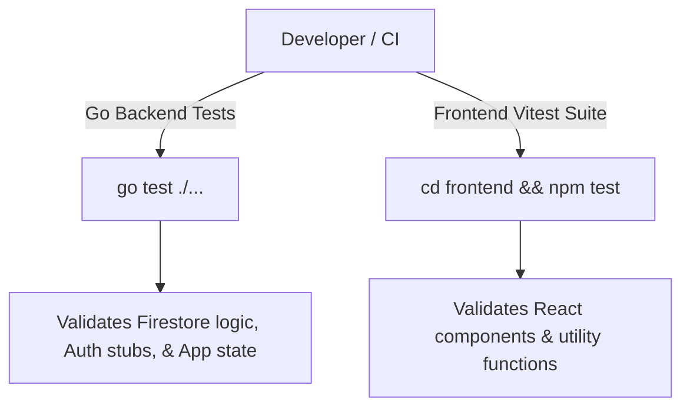

# Testing and QA Guide

Maintaining high code quality across both the Go backend and React frontend is essential for stability.

## Test Suites & Execution



### 1. Go Backend Tests
Run backend unit tests from the repository root:
```bash
go test ./... -v
```
- Tests cover core data handling, configuration parsing, and Firestore mock operations (`firestore_test.go`, `app_test.go`).

### 2. Frontend Unit Tests
Run frontend tests using Vitest inside the `frontend/` directory:
```bash
cd frontend
npm test
```
- Tests validate React component utility functions (`utils.test.ts`, `utils.ts`).

## Related Concepts
- Tests validate business logic defined in [Flashcards and Decks](/openwiki/domain/flashcards-and-decks.md).
- Ensures reliability of services established in [Architecture Overview](/openwiki/architecture/overview.md).
