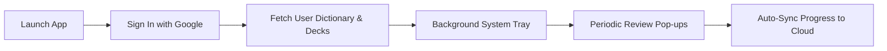

# User Help & Customer Guide

Welcome to the **TaalGem Desktop Companion** user guide! This documentation is designed for language learners using the desktop application to practice Dutch vocabulary, manage word decks, and stay consistent with spaced repetition study sessions.

---

## 1. Getting Started & App Launch

### Launching the Application
1. Open the **TaalGem Desktop Companion** application on your computer (Windows, macOS, or Linux).
2. The application opens directly to the main study and dictionary dashboard.
3. When minimized, TaalGem continues running quietly in your system tray (near your clock on Windows, or in the menu bar on macOS), ready to pop up review reminders when cards are due.

### Launch at Login (Automatic Startup)
To ensure you never miss your daily vocabulary practice:
1. Navigate to **Settings** (gear icon in the navigation bar).
2. Locate the **Launch at Startup** toggle under **Application Preferences**.
3. Enable **Launch at Login** to automatically start TaalGem in the system tray whenever your computer turns on.

---

## 2. Account Sign-In & Cloud Sync

### Google Sign-In
When you first start TaalGem, you will be asked to sign in:
- Click **Sign in with Google** to authenticate securely.
- TaalGem connects directly with your existing TaalGem account and synchronizes your saved words, custom decks, and study progress from the web version (`gemini-dutch-practice`).
- Once signed in, your session remains active securely on your machine so you do not need to sign in every time you open the app.

### How Cloud Synchronization Works
Your Dutch vocabulary, study history, and custom decks are kept in sync automatically across all your devices:
- **Startup Sync:** Whenever the application launches or unlocks, it automatically fetches your latest dictionary and pending flashcard reviews from the cloud.
- **Review Sync:** Every time you complete a flashcard and select a difficulty rating, your new review date and spaced-repetition progress sync immediately to the cloud.
- **Periodic Sync:** A background timer regularly checks for newly added words or deck updates.
- **Manual Refresh:** You can manually refresh your cards and dictionary anytime by clicking the **Sync / Refresh** button in the top bar or in **Settings**.

---

## 3. Flashcard Practice & Study Sessions

### Review Reminders & Pop-ups
TaalGem helps you build a daily study habit by reminding you when flashcards are due:
- When review cards are due according to your spaced repetition schedule, the app window automatically pops up over your work.
- If you are busy, you can quickly answer a few cards and close the window, or snooze reminders using Do Not Disturb mode.

### Do Not Disturb (DND) Mode
If you need uninterrupted focus during meetings or deep work:
1. Click the **Do Not Disturb** timer button in the top bar.
2. Select your desired pause duration:
   - **30 minutes**
   - **1 hour**
   - **2 hours**
   - **4 hours**
   - **8 hours**
3. While DND is active, background pop-ups are paused. You can clear DND early at any time by clicking **Clear DND** in the top bar.

### Interactive Card Modes & Controls
During a study session, you will encounter two primary card types:
- **Normal Cards (Dutch to English):** See the Dutch word or phrase, guess its meaning, flip the card to reveal the translation, example sentences, and audio.
- **Reverse Cards (English to Dutch):** Practice active recall by translating from English back into Dutch.
- **Audio Pronunciation:** Click the speaker icon on any card to hear native audio pronunciation for the word.
- **Rating Your Answer:** After revealing the answer, select how well you remembered the word:
  - **Again:** You forgot the word; it will reappear soon.
  - **Hard:** You remembered with difficulty; shortened review interval.
  - **Good:** You remembered correctly; normal review interval.
  - **Easy:** You knew it instantly; extended review interval.

### Practice All Words
If you have no cards currently due for review but still want to study:
- Click **Practice All Words** on the summary screen to review your full dictionary regardless of scheduled review dates.

---

## 4. Dictionary & Custom Word Decks

### Browsing Your Dictionary
- Click the **Dictionary / Words** tab to view your complete vocabulary collection.
- Use the search bar to filter words by Dutch term or English translation.
- View detailed metadata for each word, including current review level, upcoming review date, and associated decks.

### Creating & Managing Decks
Organize your vocabulary into thematic collections (e.g., "Travel", "Work", "Verbs"):
1. Go to **Settings** -> **Deck Management**.
2. Type a new deck name in the input box and click **Create Deck**.
3. To rename a deck, enter a new title and click **Rename**.
4. To remove a deck, click **Delete**. (Deleting a deck does not delete the words inside it; words return to the default dictionary).

### Assigning Words to Decks
1. In the **Dictionary** tab, click **Manage Decks** next to any word.
2. Check or uncheck the decks you want to assign that word to.
3. Changes save automatically and sync to the cloud.

---

## 5. Application Settings & Customization

Access **Settings** from the navigation bar to customize your experience:

| Setting | Options | Description |
| :--- | :--- | :--- |
| **Pop-Up Interval** | 15m, 30m, 1h, 2h, 4h | How frequently review pop-up reminders appear when cards are due. |
| **Auto-Hide Window** | Enabled / Disabled | Automatically hides the app window once all due flashcards are completed. |
| **Launch at Login** | Enabled / Disabled | Automatically runs TaalGem in the system tray when your computer boots up. |
| **Challenge Mode** | Normal / Reverse / Mixed | Choose whether pop-ups ask for Dutch->English, English->Dutch, or both. |
| **Account / Sign Out** | Logout | Displays your logged-in Google email and allows logging out. |

---

## 6. Frequently Asked Questions & Troubleshooting

**Q: Why are flashcard pop-ups not appearing?**
- Check if **Do Not Disturb (DND)** mode is active.
- Verify that you have cards due for review in your dictionary.
- Ensure the app is running in your system tray.

**Q: My words aren't updating from the web app. What should I do?**
- Click the **Sync** button in the top bar or under **Settings** -> **Cloud Sync**.
- Ensure your computer is connected to the internet. If network recovery is active, TaalGem will re-establish connection automatically once network availability returns.

**Q: How do I stop TaalGem from popping up while presenting?**
- Enable **Do Not Disturb** mode from the top bar for 1 to 8 hours before starting your presentation.

---

## Related Documentation

For technical, architecture, and deployment information for developers, refer to:
- [TaalGem Quickstart](/openwiki/quickstart.md)
- [Wails Runtime and Backend Architecture](/openwiki/architecture/overview.md)
- [Authentication and Sync Architecture](/openwiki/operations/authentication-and-sync.md)
